# Project write-up

## Research question

High yielding corn removes large quantities of phosphorus, potassium and sulfur
from the soil each season. Growers are advised to replace what the crop removes.
Using data from Wortmann et al. (2022), it was evaluated whether applied
phosphorus and potassium increased yield once nitrogen supply, plant stand and
irrigation were accounted for. A second question was how much of the variation in
yield came from treatment at all, and how much from the field and the season.

## Loading and cleaning the data

The data cover 34 site-years of irrigated corn trials run across Nebraska between
2002 and 2004. A site-year is one field in one season, and it serves as the
experimental block throughout. The deposit holds 1483 plot observations with 162
variables each.

Three cleaning decisions shaped the work that followed. Only metric measurements
were kept, because the deposit records most quantities twice, once in metric and
once in English units, and keeping both would produce perfectly collinear pairs.
The analysis was then restricted to the nine standard treatments applied at every
site-year. This excluded 272 plots in site-specific treatments numbered 10 to 12,
which exist at only one or two locations. The restriction leaves 1211 plots in
306 design cells, with two to four replicates in each and no cell empty, which is
what makes the treatment comparisons balanced.

The third decision corrected the deposit. Soil texture class is recorded as both
`lS` and `ls`, the second at a single site-year. That site-year lies on the Vetal
soil series, which carries the `lS` label elsewhere in the same file. The deposit
capitalizes the noun and leaves the modifier lowercase, giving `siCL` for silty
clay loam and `sL` for sandy loam, so `lS` denotes loamy sand. The two spellings
were merged, affecting 37 plots.

The treatment structure is what makes the question answerable. Five treatments
step nitrogen from zero to the highest rate. Two omit phosphorus or potassium at
a fixed nitrogen rate. One doubles both. One applies the university recommended
rates. An omission plot differs from the complete treatment in a single nutrient,
so the difference between the two isolates that nutrient.

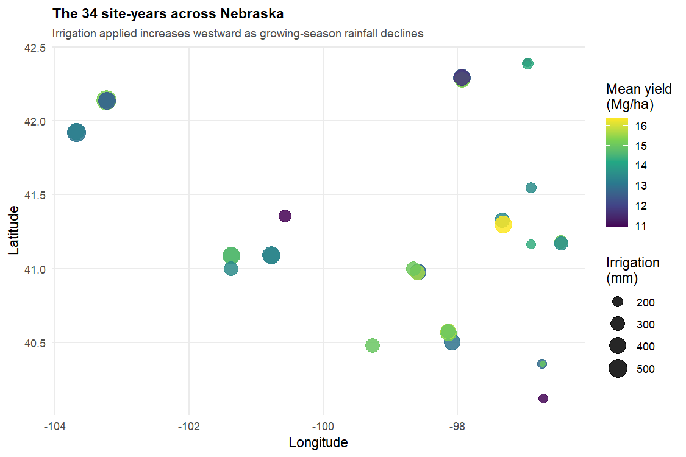

## Exploratory data analysis

Yield across the 1211 plots averaged 13.85 Mg/ha with a standard deviation of
2.21 Mg/ha, ranging from 3.66 to 19.01 Mg/ha.

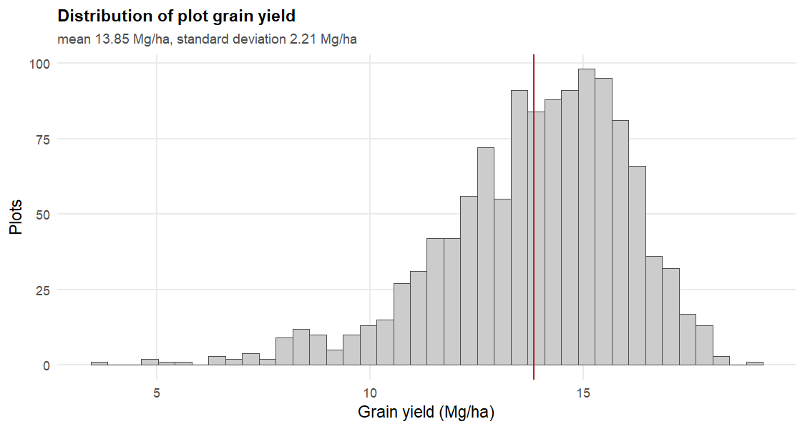

The most important structural fact appeared at this stage. Differences between
site-years account for 41 percent of the plot-level sum of squares. Field and
season together explain more of what a plot yields than any treatment does.
Comparing plots from different fields would confound the treatment effect with
the field effect. All comparisons below were therefore made within site-years, as
paired differences across the 34 blocks.

Correlations among the plant measurements are strong and largely structural,
since grain, cob and stover dry matter sum to total dry matter by definition.

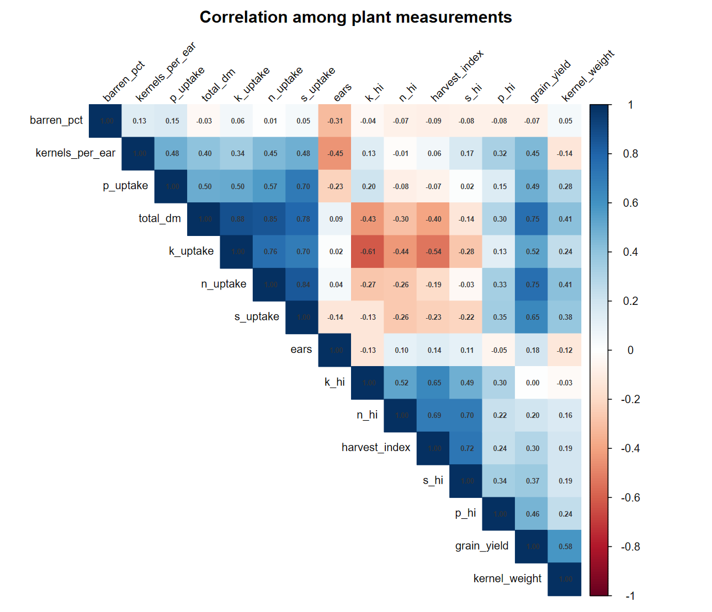

Those correlations were then recomputed within subgroups. The pooled correlation
between yield and nitrogen uptake is 0.75, but within individual site-years it
ranges from 0.44 to a median of 0.87. For plant population the pooled correlation
of 0.23 reverses sign inside five site-years. This is Simpson's paradox, where an
association computed across pooled groups differs from, or opposes, the
association within every group.

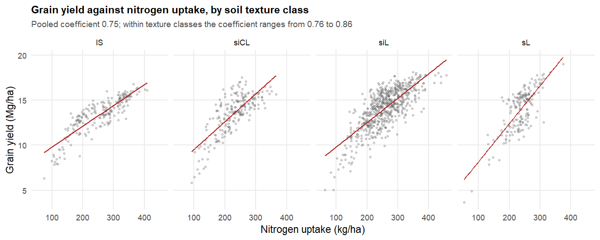

## Feature engineering

Principal component analysis was applied to fifteen standardized plant
measurements to reduce that redundancy. Four components were retained under
Kaiser's criterion, which keeps components with an eigenvalue above one. Such a
component explains more variance than a single original variable would. The four
account for 78 percent of total variance, and the first alone accounts for 37
percent. Its loadings show that it describes overall crop size and no treatment
contrast.

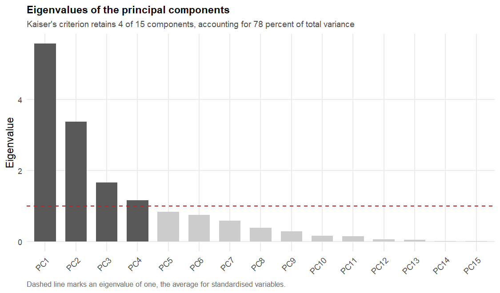
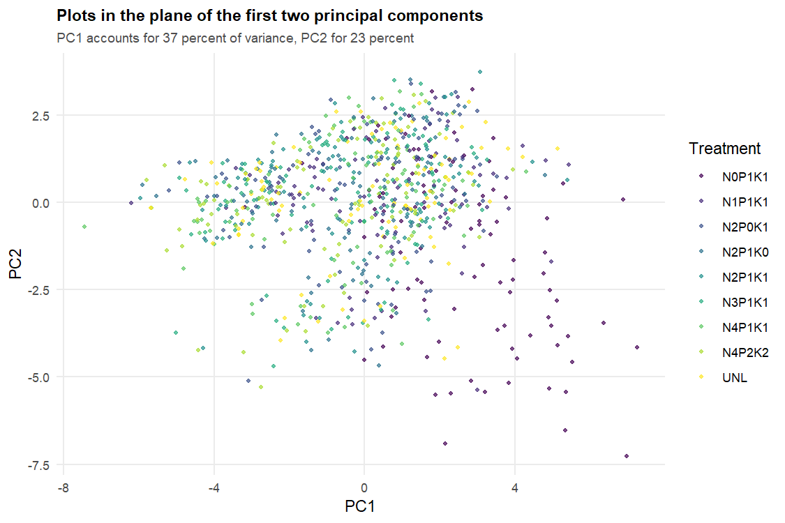

K-means clustering was run to test whether plots group by treatment. The number
of clusters was not fixed in advance. It was set to three by majority vote across
24 indices computed by the NbClust package, seven of which favored three. The
clusters were compared against site-year and against treatment using Cramér's V,
a measure of association between two categorical variables running from zero for
independence to one for perfect correspondence. The clusters track site-year at
0.67 and treatment at 0.30. The clustering therefore recovers which field a plot
came from, and not how it was fertilized.

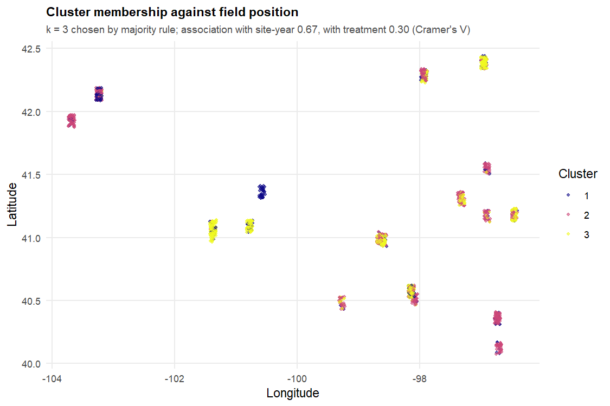

## Modeling and hypothesis testing

Five treatment contrasts were tested, each as a paired difference of site-year
means across the 34 blocks. P-values were adjusted by the Holm method, which
controls the probability of any false rejection across the whole family of five
tests.

| Contrast | Effect (Mg/ha) | 95 percent interval | p, Holm-adjusted |
|---|---:|---|---:|
| Nitrogen, none to mid rate | 3.61 | 2.85 to 4.37 | 2e-10 |
| Nitrogen, mid to high rate | 0.36 | 0.15 to 0.57 | 0.005 |
| Phosphorus applied against omitted | 0.19 | -0.10 to 0.48 | 0.39 |
| Potassium applied against omitted | -0.26 | -0.47 to -0.04 | 0.068 |
| Phosphorus and potassium doubled | 0.08 | -0.09 to 0.24 | 0.39 |

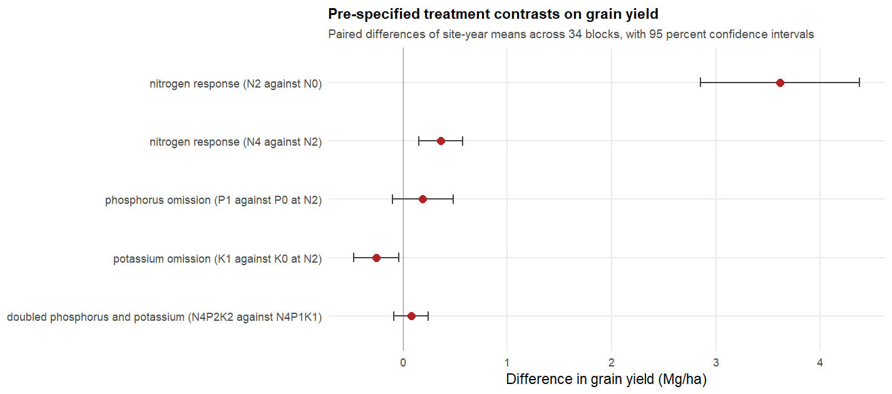

Nitrogen drove yield, steeply to the mid rate and very little beyond it. Neither
phosphorus nor potassium produced a detectable response. The potassium estimate
is negative and does not survive adjustment for the family of five tests, and a
negative estimate is the opposite of a fertilizer response.

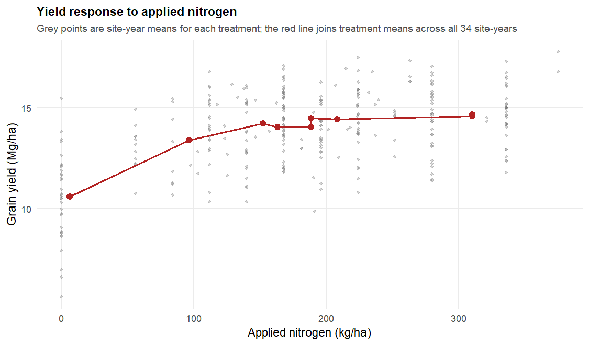
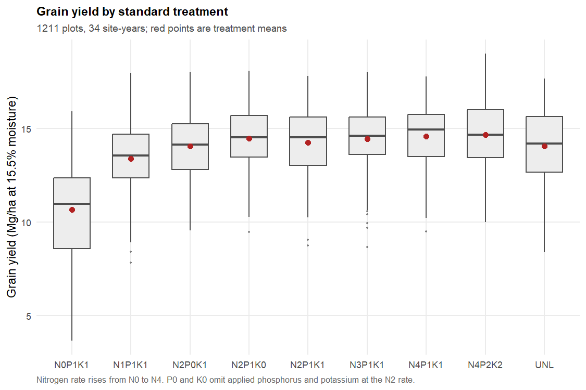

The assumption checks are reported whichever way they came out. Residuals from
the plot-level analysis of variance fail a Shapiro-Wilk normality test at
p = 1.1e-13, and treatment variances are unequal by the Brown-Forsythe test at
p = 3.2e-07. Both violations argue against relying on that model. The paired
contrasts above do not depend on it. The 34 block differences underlying each
contrast do satisfy normality, the smallest p-value across the five being 0.14.

Yield was then predicted from pre-harvest information using
leave-one-site-year-out cross-validation. The model is trained on 33 site-years
and tested on the one held out, and this is repeated 34 times. Every test is
therefore on a field the model has never seen. A random forest reached RMSE 1.95
Mg/ha and an R-squared of 0.22, against 2.24 Mg/ha for predicting the training
mean. Nitrogen dominated the importance ranking, and the phosphorus and potassium
rates fell below every soil test variable. This reaches the experimental
conclusion by an independent route.

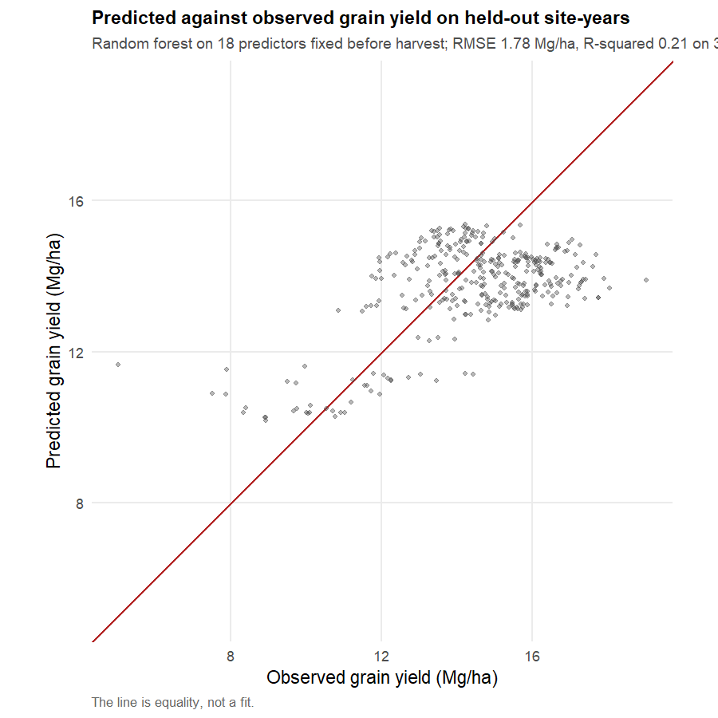
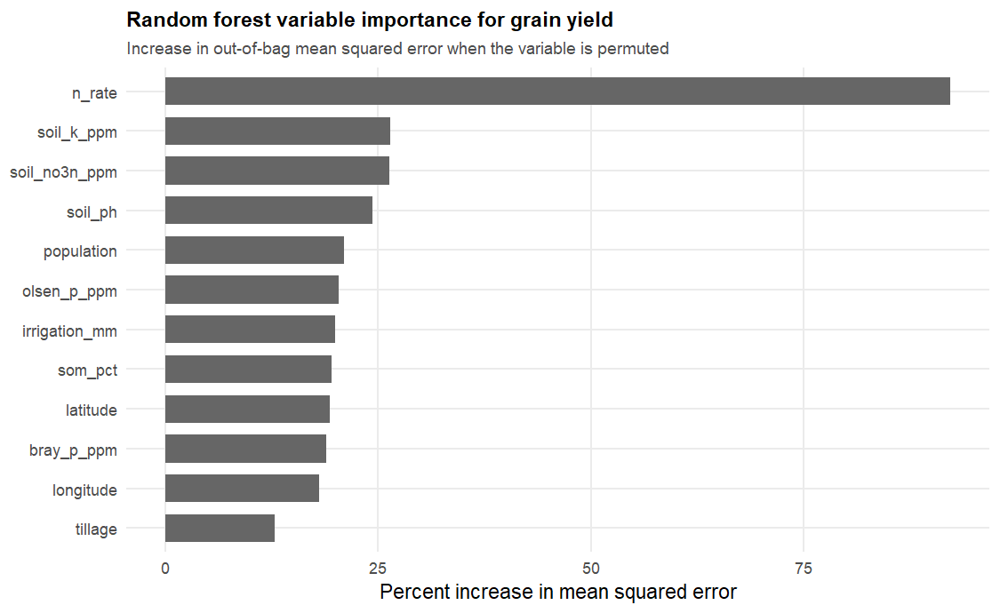

Two ways of inflating that result were measured. Allowing harvest measurements
among the predictors raises the held-out R-squared from 0.21 to 0.97, almost all
of which is the arithmetic identity that total dry matter contains grain dry
matter. Splitting the data over plots instead of site-years raises it to 0.73,
because replicate plots from the same field in the same season are near duplicates
of one another.

## Insights

Applied phosphorus and potassium did not pay in yield within a season at this
trial's soil test levels. The confidence intervals make that a useful statement.
None of them admits an effect above roughly half a megagram per hectare, about
one seventh of the nitrogen response.

That null result agrees with the published analysis of the same trials. Wortmann
et al. (2009) concluded that phosphorus pays when Bray-1 soil test phosphorus
falls below about 10 ppm, and that potassium response is unlikely above 125 ppm.
These site-years sat mostly above both thresholds. Median Bray-1 phosphorus was
18 ppm, with only 5 of 34 site-years below 10 ppm, and median potassium was 457
ppm, with 31 of 34 site-years above 125 ppm. The absence of a response is what
the existing recommendation predicts for these fields. It is not evidence that
phosphorus and potassium never pay.

Sulfur could not be assessed. The nine standard treatments all received a similar
low sulfur rate, and the sulfur sub-treatments exist at only one or two
site-years each, which confounds the sulfur treatment with the site.

Two limitations affect how far these results carry. The retained principal
components proved difficult to map back onto individual measurements in a way
that would support a fertilizer decision, so they describe the data better than
they guide practice. The predictors also carry measurement error. Soil texture
class is a field judgment and not a laboratory determination, and this deposit
records one texture class under two spellings, which is that subjectivity
appearing directly in the record. A model fitted to such inputs should be
expected to transfer imperfectly to a field it has not seen.

Full citations are in [references.md](references.md).
